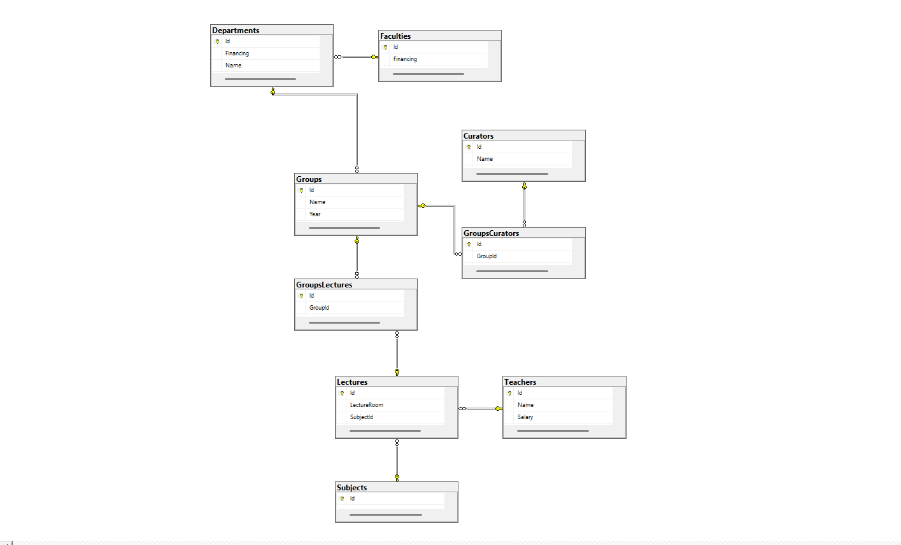

<div align="center">

# 🎓 SQL Relational Architect

### *A Deep Dive into Enterprise-Grade Database Design*

[](https://www.microsoft.com/en-us/sql-server)
[](https://docs.microsoft.com/en-us/sql/t-sql/)
[](https://github.com/huseynovanzrin142-beep/sql-relational-architect)
[](LICENSE)

*From relational integrity and cascade logic to complex multi-table JOINs - this repository documents a journey of mastering clean, professional, and efficient T-SQL patterns.*

[📊 View Database Diagram](#-database-architecture) • [🚀 Quick Start](#-quick-start) • [💡 Key Features](#-key-features) • [📖 Documentation](#-comprehensive-queries)

</div>

---

## 📋 Table of Contents

- [🎯 Project Overview](#-project-overview)
- [🏗️ Database Architecture](#-database-architecture)
- [✨ Key Features](#-key-features)
- [🚀 Quick Start](#-quick-start)
- [📊 Database Schema](#-database-schema)
- [🔍 Comprehensive Queries](#-comprehensive-queries)
- [💾 Technologies Used](#-technologies-used)
- [🤝 Contributing](#-contributing)
- [📫 Connect With Me](#-connect-with-me)

---

## 🎯 Project Overview

**CombinationDB** is a comprehensive university management database system that demonstrates advanced SQL Server concepts and best practices. This project showcases:

- ✅ **Robust relational design** with proper normalization
- ✅ **Cascading referential integrity** across all foreign keys
- ✅ **Complex multi-table JOIN operations** (up to 6 tables)
- ✅ **Data validation** through CHECK constraints
- ✅ **Professional T-SQL coding standards**
- ✅ **Real-world academic scenarios** and query patterns

> **💡 Perfect for:** Database students, SQL learners, and developers looking to understand enterprise-grade database architecture.

---

## 🏗️ Database Architecture

The database models a complete university ecosystem with **9 interconnected tables** managing faculties, departments, students, teachers, and academic schedules.

### 📐 Entity Relationship Diagram



### 🔗 Relationship Overview

| Relationship | Type | Cascade Behavior |
|-------------|------|------------------|
| `Faculties` → `Departments` | One-to-Many | CASCADE |
| `Departments` → `Groups` | One-to-Many | CASCADE |
| `Groups` → `GroupsLectures` | Many-to-Many | CASCADE |
| `Teachers` → `Lectures` | One-to-Many | CASCADE |
| `Subjects` → `Lectures` | One-to-Many | CASCADE |
| `Curators` → `GroupsCurators` | Many-to-Many | CASCADE |

---

## ✨ Key Features

### 🛡️ **1. Comprehensive Data Integrity**

```sql
-- Salary validation
CONSTRAINT CK_Salary CHECK ([Salary] > 0)

-- Financing validation
CONSTRAINT CK_Departments_Financing CHECK ([Financing] >= 0)

-- Academic year validation
CONSTRAINT year_ck CHECK([Year] >= 1 AND [Year] <= 5)
```

### 🔄 **2. Cascade Operations**

All foreign keys implement `ON UPDATE CASCADE` and `ON DELETE CASCADE` for seamless data management:

```sql
CONSTRAINT department_fk 
    FOREIGN KEY ([FacultyId]) 
    REFERENCES Faculties([Id]) 
    ON UPDATE CASCADE 
    ON DELETE CASCADE
```

### 🎨 **3. Smart Default Values**

```sql
[Name] NVARCHAR(MAX) NOT NULL DEFAULT 'NO NAME'
[Financing] MONEY NOT NULL DEFAULT 0
```

### 🔍 **4. Advanced Query Patterns**

- ✅ CROSS JOIN for cartesian products
- ✅ Multiple INNER JOINs (up to 6 tables)
- ✅ Complex filtering with WHERE clauses
- ✅ DISTINCT for duplicate elimination
- ✅ Aggregate and analytical operations

---

## 🚀 Quick Start

### Prerequisites

- SQL Server 2016 or later
- SQL Server Management Studio (SSMS)
- Or any T-SQL compatible IDE

### Installation

1. **Clone the repository**
   ```bash
   git clone https://github.com/huseynovanzrin142-beep/sql-relational-architect.git
   cd sql-relational-architect
   ```

2. **Open SQL Server Management Studio**

3. **Execute the script**
   ```sql
   -- Open Combination.sql in SSMS
   -- Press F5 or click Execute
   ```

4. **Verify installation**
   ```sql
   USE CombinationDB;
   SELECT COUNT(*) AS TableCount 
   FROM INFORMATION_SCHEMA.TABLES 
   WHERE TABLE_TYPE = 'BASE TABLE';
   -- Should return 9
   ```

---

## 📊 Database Schema

### 🏛️ **Core Entities**

<details open>
<summary><b>👥 Curators</b></summary>

```sql
CREATE TABLE Curators (
    [Id] INT PRIMARY KEY IDENTITY(1,1) NOT NULL,
    [Name] NVARCHAR(MAX) NOT NULL DEFAULT 'NO NAME',
    [Surname] NVARCHAR(MAX) NOT NULL DEFAULT 'NO SURNAME'
)
```

**Purpose:** Manages academic advisors assigned to student groups

</details>

<details>
<summary><b>👨‍🏫 Teachers</b></summary>

```sql
CREATE TABLE Teachers (
    [Id] INT PRIMARY KEY IDENTITY(1,1) NOT NULL,
    [Name] NVARCHAR(MAX) NOT NULL DEFAULT 'NO NAME',
    [Salary] MONEY NOT NULL,
    [Surname] NVARCHAR(MAX) NOT NULL DEFAULT 'NO SURNAME',
    CONSTRAINT CK_Salary CHECK ([Salary] > 0)
)
```

**Purpose:** Stores faculty members with salary validation

</details>

<details>
<summary><b>🏢 Faculties</b></summary>

```sql
CREATE TABLE Faculties (
    [Id] INT PRIMARY KEY IDENTITY(1,1) NOT NULL,
    [Financing] MONEY NOT NULL DEFAULT 0,
    [Name] NVARCHAR(100) UNIQUE NOT NULL DEFAULT 'NO NAME',
    CONSTRAINT CK_Faculties_Financing CHECK ([Financing] >= 0)
)
```

**Purpose:** Top-level organizational units (e.g., Computer Science, Mathematics)

</details>

<details>
<summary><b>📚 Subjects</b></summary>

```sql
CREATE TABLE Subjects (
    [Id] INT PRIMARY KEY IDENTITY(1,1) NOT NULL,
    [Name] NVARCHAR(100) UNIQUE NOT NULL DEFAULT 'NO NAME'
)
```

**Purpose:** Academic courses and disciplines

</details>

<details>
<summary><b>🏫 Departments</b></summary>

```sql
CREATE TABLE Departments (
    [Id] INT PRIMARY KEY IDENTITY(1,1) NOT NULL,
    [Financing] MONEY NOT NULL DEFAULT 0,
    [Name] NVARCHAR(100) UNIQUE NOT NULL DEFAULT 'NO NAME',
    [FacultyId] INT NOT NULL,
    CONSTRAINT CK_Departments_Financing CHECK ([Financing] >= 0),
    CONSTRAINT department_fk FOREIGN KEY ([FacultyId]) 
        REFERENCES Faculties([Id]) 
        ON UPDATE CASCADE 
        ON DELETE CASCADE
)
```

**Purpose:** Sub-units within faculties (e.g., Software Engineering, Applied Math)

</details>

<details>
<summary><b>👥 Groups</b></summary>

```sql
CREATE TABLE Groups (
    [Id] INT PRIMARY KEY IDENTITY(1,1) NOT NULL,
    [Name] NVARCHAR(10) UNIQUE NOT NULL DEFAULT 'NO NAME',
    [Year] INT NOT NULL,
    [DepartmentId] INT NOT NULL,
    CONSTRAINT year_ck CHECK([Year] >= 1 AND [Year] <= 5),
    CONSTRAINT departmentId_fk FOREIGN KEY ([DepartmentId]) 
        REFERENCES Departments([Id]) 
        ON UPDATE CASCADE 
        ON DELETE CASCADE
)
```

**Purpose:** Student cohorts with academic year validation

</details>

<details>
<summary><b>🎓 Lectures</b></summary>

```sql
CREATE TABLE Lectures (
    [Id] INT PRIMARY KEY IDENTITY(1,1) NOT NULL,
    [LectureRoom] NVARCHAR(MAX) NOT NULL DEFAULT 'NO NAME',
    [SubjectId] INT NOT NULL,
    [TeacherId] INT NOT NULL,
    CONSTRAINT FK_Lectures_Subjects FOREIGN KEY ([SubjectId]) 
        REFERENCES Subjects([Id]) 
        ON UPDATE CASCADE 
        ON DELETE CASCADE,
    CONSTRAINT FK_Lectures_Teachers FOREIGN KEY ([TeacherId]) 
        REFERENCES Teachers([Id]) 
        ON UPDATE CASCADE 
        ON DELETE CASCADE
)
```

**Purpose:** Links teachers, subjects, and classroom locations

</details>

### 🔗 **Junction Tables (Many-to-Many)**

<details>
<summary><b>📅 GroupsLectures</b></summary>

```sql
CREATE TABLE GroupsLectures (
    [Id] INT PRIMARY KEY IDENTITY(1,1) NOT NULL,
    [GroupId] INT NOT NULL,
    [LectureId] INT NOT NULL,
    CONSTRAINT goupId_fk FOREIGN KEY ([GroupId]) 
        REFERENCES Groups([Id]) 
        ON UPDATE CASCADE 
        ON DELETE CASCADE,
    CONSTRAINT lectureId_fk FOREIGN KEY ([LectureId]) 
        REFERENCES Lectures([Id]) 
        ON UPDATE CASCADE 
        ON DELETE CASCADE
)
```

**Purpose:** Maps which groups attend which lectures

</details>

<details>
<summary><b>👨‍💼 GroupsCurators</b></summary>

```sql
CREATE TABLE GroupsCurators (
    [Id] INT PRIMARY KEY IDENTITY(1,1) NOT NULL,
    [GroupId] INT NOT NULL,
    [CuratorId] INT NOT NULL,
    CONSTRAINT FK_Groups_Id FOREIGN KEY ([GroupId]) 
        REFERENCES Groups([Id]) 
        ON UPDATE CASCADE 
        ON DELETE CASCADE,
    CONSTRAINT curatorId_fk FOREIGN KEY ([CuratorId]) 
        REFERENCES Curators([Id]) 
        ON UPDATE CASCADE 
        ON DELETE CASCADE
)
```

**Purpose:** Assigns curators to student groups

</details>

---

## 🔍 Comprehensive Queries

The project includes **11 advanced queries** demonstrating various SQL techniques:

### 🎯 **1. Cartesian Product Analysis**

```sql
-- Generate all possible teacher-group combinations
SELECT T.*, G.* 
FROM Teachers AS T
CROSS JOIN Groups AS G;
```

**Use Case:** Scheduling feasibility analysis

---

### 💰 **2. Budget Anomaly Detection**

```sql
-- Find departments with funding exceeding their parent faculty
SELECT F.[Name] 
FROM Faculties AS F
INNER JOIN Departments AS D 
    ON D.[FacultyId] = F.[Id] 
    AND D.[Financing] > F.[Financing];
```

**Business Logic:** Identifies inconsistent budget allocations

---

### 👨‍💼 **3. Curator-Group Mapping**

```sql
-- List all curators and their assigned groups
SELECT C.[Name], G.[Name] 
FROM Curators AS C 
INNER JOIN GroupsCurators AS GC
    ON C.[Id] = GC.[CuratorId] 
INNER JOIN Groups AS G 
    ON G.[Id] = GC.[GroupId];
```

---

### 🎓 **4. Group-Specific Teacher Lookup**

```sql
-- Find teachers lecturing to group P107
SELECT T.[Name] 
FROM Teachers AS T
INNER JOIN Lectures AS L 
    ON T.[Id] = L.[TeacherId] 
INNER JOIN GroupsLectures AS GL
    ON L.[Id] = GL.[LectureId] 
INNER JOIN Groups AS G 
    ON GL.[GroupId] = G.[Id] 
WHERE G.[Name] = 'P107';
```

**Complexity:** 4-table JOIN with filtering

---

### 🏢 **5. Faculty-Teacher Association**

```sql
-- Map teachers to their teaching faculties
SELECT T.[Surname], F.[Name] 
FROM Teachers AS T
INNER JOIN Lectures AS L
    ON T.[Id] = L.[TeacherId] 
INNER JOIN GroupsLectures AS GL
    ON L.[Id] = GL.[LectureId] 
INNER JOIN Groups AS G
    ON GL.[GroupId] = G.[Id] 
INNER JOIN Departments AS D
    ON G.[DepartmentId] = D.[Id] 
INNER JOIN Faculties AS F 
    ON D.[FacultyId] = F.[Id];
```

**Complexity:** 6-table JOIN traversing the entire hierarchy

---

### 🏫 **6. Department-Group Listing**

```sql
-- Display all departments with their student groups
SELECT D.[Name], G.[Name] 
FROM Departments AS D
INNER JOIN Groups AS G 
    ON D.[Id] = G.[DepartmentId];
```

---

### 👩‍🏫 **7. Teacher Subject Catalog**

```sql
-- Find all subjects taught by Samantha Adams
SELECT S.[Name] 
FROM Subjects AS S
INNER JOIN Lectures AS L
    ON S.[Id] = L.[SubjectId] 
INNER JOIN Teachers AS T 
    ON L.[TeacherId] = T.[Id] 
WHERE T.[Name] = 'Samantha' 
  AND T.[Surname] = 'Adams';
```

---

### 📚 **8. Course Department Tracking**

```sql
-- Locate departments offering Database Theory
SELECT DISTINCT D.[Name] 
FROM Departments AS D
INNER JOIN Groups AS G
    ON D.[Id] = G.[DepartmentId]
INNER JOIN GroupsLectures AS GL
    ON G.[Id] = GL.[GroupId]  
INNER JOIN Lectures AS L
    ON GL.[LectureId] = L.[Id]
INNER JOIN Subjects AS S
    ON L.[SubjectId] = S.[Id] 
WHERE S.[Name] = 'Database Theory';
```

**Note:** Uses `DISTINCT` to eliminate duplicate departments

---

### 🖥️ **9. Faculty Group Roster**

```sql
-- List all groups in Computer Science faculty
SELECT G.[Name] 
FROM Groups AS G
INNER JOIN Departments AS D
    ON G.[DepartmentId] = D.[Id] 
INNER JOIN Faculties AS F 
    ON D.[FacultyId] = F.[Id] 
WHERE F.[Name] = 'Computer Science';
```

---

### 🎓 **10. Senior Year Analysis**

```sql
-- Find all 5th-year groups with their faculties
SELECT G.[Name], F.[Name] 
FROM Groups AS G
INNER JOIN Departments AS D
    ON G.[DepartmentId] = D.[Id] 
INNER JOIN Faculties AS F 
    ON D.[FacultyId] = F.[Id]
WHERE G.[Year] = 5;
```

---

### 📍 **11. Classroom Schedule Details**

```sql
-- Complete lecture information for room B103
SELECT T.[Name], S.[Name], G.[Name] 
FROM Teachers AS T
INNER JOIN Lectures AS L
    ON T.[Id] = L.[TeacherId] 
INNER JOIN Subjects AS S
    ON S.[Id] = L.[SubjectId] 
INNER JOIN GroupsLectures AS GL
    ON L.[Id] = GL.[LectureId] 
INNER JOIN Groups AS G 
    ON GL.[GroupId] = G.[Id] 
WHERE L.[LectureRoom] = 'B103';
```

**Output:** Teacher name, subject, and group for a specific classroom

---

## 💾 Technologies Used

| Technology | Purpose |
|-----------|---------|
|  | Database engine |
|  | Query language |
|  | Normalization & ERD |
|  | Development environment |

### 🎓 **Concepts Demonstrated:**

- **Normalization:** Third Normal Form (3NF)
- **Referential Integrity:** CASCADE operations
- **Constraints:** CHECK, UNIQUE, PRIMARY KEY, FOREIGN KEY
- **JOINs:** CROSS JOIN, INNER JOIN (up to 6 tables)
- **Data Types:** INT, NVARCHAR, MONEY
- **Identity Columns:** Auto-incrementing primary keys
- **Transaction Management:** Database-level operations

---

## 🤝 Contributing

Contributions are welcome! Here's how you can help:

1. 🍴 Fork the repository
2. 🔧 Create a feature branch (`git checkout -b feature/AmazingFeature`)
3. 💾 Commit your changes (`git commit -m 'Add some AmazingFeature'`)
4. 📤 Push to the branch (`git push origin feature/AmazingFeature`)
5. 🎉 Open a Pull Request

### 💡 Ideas for Contributions:

- Add stored procedures for common operations
- Implement views for complex queries
- Create indexes for performance optimization
- Add more sample data
- Write unit tests
- Improve query efficiency

---

## 📫 Connect With Me

<div align="center">

[](https://github.com/huseynovanzrin142-beep)
[](https://linkedin.com/in/anzrin-huseynov)
[](mailto:huseynovanzrin142@gmail.com)

</div>

---

## 📄 License

This project is licensed under the MIT License - see the [LICENSE](LICENSE) file for details.

---

<div align="center">

### ⭐ If you find this project helpful, please consider giving it a star!

**Made with ❤️ and SQL**


---

</div>
